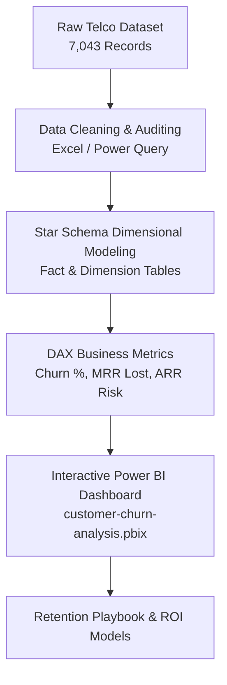

# 📉 Telco Customer Churn & Retention Analytics Dashboard

[](customer-churn-analysis.pbix)
[](telco_churn_cleaned.xlsx)
[](customer-churn-analysis.pbix)
[](WA_Fn-UseC_-Telco-Customer-Churn.csv)
[](https://github.com/Megharaju-Vakiti/customer-churn-analysis)
[](https://github.com/Megharaju-Vakiti/customer-churn-analysis)
[](LICENSE)

> **An end-to-end subscription business intelligence solution evaluating 7,043 enterprise customer accounts and $1.67 Million in annualized revenue at risk. Built using Power BI, Advanced Excel, and DAX modeling to diagnose churn triggers, isolate high-risk customer cohorts (Month-to-Month contracts at 42.7% churn), and architect data-driven retention campaigns.**

---

## 📌 Table of Contents

- [Executive Summary](#-executive-summary)
- [Project Overview & Business Objectives](#-project-overview--business-objectives)
- [Key Retention Performance Indicators (KPIs)](#-key-retention-performance-indicators-kpis)
- [Interactive Power BI Dashboard Previews](#-interactive-power-bi-dashboard-previews)
- [Dataset Architecture & Feature Dictionary (21 Fields)](#-dataset-architecture--feature-dictionary-21-fields)
- [Data Modeling & DAX Calculation Architecture](#-data-modeling--dax-calculation-architecture)
- [Deep Dive: Key Findings & Churn Intelligence](#-deep-dive-key-findings--churn-intelligence)
  - [1. Contract Type: The #1 Churn Driver (15x Risk Variance)](#1-contract-type-the-1-churn-driver-15x-risk-variance)
  - [2. The Onboarding Vulnerability Window (0–12 Months)](#2-the-onboarding-vulnerability-window-012-months)
  - [3. The Fiber Optic Pricing Paradox](#3-the-fiber-optic-pricing-paradox)
  - [4. Payment Friction: Electronic Checks vs. Autopay](#4-payment-friction-electronic-checks-vs-autopay)
  - [5. Support Services as Retention Anchors](#5-support-services-as-retention-anchors)
- [Strategic Customer Retention Playbook](#-strategic-customer-retention-playbook)
- [Repository Structure](#-repository-structure)
- [How to Explore This Project](#-how-to-explore-this-project)
- [Author & Contact](#-author--contact)

---

## 🚀 Executive Summary

Customer churn is the single greatest existential threat to subscription and recurring revenue business models. Acquiring new customers costs 5 to 7 times more than retaining existing ones, making predictive attrition detection essential for healthy enterprise growth.

This project delivers an in-depth empirical investigation into **7,043 commercial telecom accounts** representing **$456,116 in Monthly Recurring Revenue (MRR)** ($5.47M ARR). The study uncovers a baseline churn rate of **26.54% (1,869 churned customers)**, translating to **$139,130 in monthly recurring revenue loss ($1,669,570 in lost ARR)**. By dissecting customer tenure, service tiers, payment mechanisms, and contract types, the analysis establishes an actionable retention framework to recover high-value accounts.

---

## 🎯 Project Overview & Business Objectives

- **Quantify Revenue Attrition:** Measure gross Monthly Recurring Revenue (MRR) and Annualized Recurring Revenue (ARR) directly lost to churn.
- **Identify Root-Cause Churn Drivers:** Evaluate the behavioral and contractual differences between retained and churned cohorts.
- **Isolate High-Risk Segments:** Determine the demographic and service tiers experiencing churn rates in excess of 40%.
- **Map the Tenure Life-Cycle:** Identify the critical onboarding inflection point where customer attrition peaks.
- **Architect Proactive Interventions:** Deliver targeted retention offers (contract migrations, autopay incentives, tech-support bundling) to save at-risk accounts.

---

## 📈 Key Retention Performance Indicators (KPIs)

| Performance Indicator | Measured Value | Analytical & Commercial Significance |
| :--- | :---: | :--- |
| **Total Customer Base** | **7,043 accounts** | Complete census of enterprise customer accounts |
| **Total Retained Customers** | **5,174 accounts (73.46%)** | Core recurring revenue foundation |
| **Total Churned Customers** | **1,869 accounts (26.54%)** | Attrition volume requiring structured intervention |
| **Total Monthly Recurring Revenue (MRR)**| **$456,116.60 / month** | Baseline subscription revenue stream ($5.47M ARR) |
| **Monthly Revenue Lost to Churn** | **$139,130.85 / month** | **30.5% of total MRR lost** (churners have higher ASP) |
| **Annualized Revenue Lost (ARR)** | **$1,669,570.20 / year** | **~$1.67 Million** annual bottom-line opportunity |
| **Avg Monthly Charge (Churned)** | **$74.44 / month** | Churned customers pay higher monthly fees |
| **Avg Monthly Charge (Retained)** | **$61.27 / month** | Retained customers hold more stable pricing tiers |
| **Month-to-Month Churn Rate** | **42.71%** | Represents **88.5%** of all churned accounts |

---

## 📊 Interactive Power BI Dashboard Previews

The project features an executive 3-page interactive Power BI dashboard (`customer-churn-analysis.pbix`):

| Executive Overview | Churn Driver Diagnostics | Risk Categorization & Segmentation |
| :---: | :---: | :---: |
|  |  |  |

---

## 🗂️ Dataset Architecture & Feature Dictionary (21 Fields)

The project evaluates `WA_Fn-UseC_-Telco-Customer-Churn.csv` (7,043 rows × 21 columns):

| Feature Name | Data Type | Description | Observed Categories / Range |
| :--- | :--- | :--- | :--- |
| `customer_ID` | String | Unique alpha-numeric account identifier | `7043` distinct IDs |
| `gender` | String | Customer gender | *Female (49.5%), Male (50.5%)* |
| `Senior_Citizen` | Binary | Customer seniority status | `0` (Non-Senior, 83.8%), `1` (Senior Citizen, 16.2%) |
| `Partner` | String | Whether customer has a domestic partner | *Yes, No* |
| `Dependents` | String | Whether customer has dependent family members | *Yes, No* |
| `tenure` | Integer | Total months customer has subscribed | `0` to `72 months` (Avg: `32.4 months`) |
| `Phone_Service` | String | Subscribed to landline phone service | *Yes, No* |
| `Multiple_Lines` | String | Multi-line telephone configuration | *Yes, No, No phone service* |
| `Internet_Service`| String | Core broadband transmission technology | *Fiber optic (44.0%), DSL (34.4%), No (21.6%)* |
| `Online_Security` | String | Add-on cyber protection package | *Yes, No, No internet service* |
| `Online_Backup` | String | Cloud data backup utility | *Yes, No, No internet service* |
| `Device_Protection`| String | Hardware coverage warranty | *Yes, No, No internet service* |
| `Tech_Support` | String | Dedicated 24/7 technical assistance | *Yes, No, No internet service* |
| `Streaming_TV` | String | Digital television streaming add-on | *Yes, No, No internet service* |
| `Streaming_Movies`| String | On-demand movie streaming package | *Yes, No, No internet service* |
| `Contract` | String | Current subscription agreement term | *Month-to-month (55.0%), One year (20.9%), Two year (24.1%)* |
| `Paperless_Billing`| String | Electronic invoicing preference | *Yes, No* |
| `Payment_Method` | String | Billing clearing channel | *Electronic check, Mailed check, Bank transfer, Credit card* |
| `Monthly_Charges` | Float | Current monthly recurring bill amount (USD) | `$18.25` to `$118.75` (Avg: `$64.76`) |
| `Total_Charges` | Float | Cumulative billing across account lifetime | `$18.80` to `$8684.80` |
| `Churn` | String | Primary binary target variable | *Yes (Exited: 26.54%), No (Retained: 73.46%)* |

---

## 🛠️ Data Modeling & DAX Calculation Architecture



### Key DAX Production Measures
```dax
// 1. Total Customer Population
Total Customers = COUNTROWS('WA_Fn-UseC_-Telco-Customer-Churn')

// 2. Churned Customer Count
Churned Customers = 
CALCULATE(
    COUNTROWS('WA_Fn-UseC_-Telco-Customer-Churn'), 
    'WA_Fn-UseC_-Telco-Customer-Churn'[Churn] = "Yes"
)

// 3. Overall Churn Rate (%)
Churn Rate = DIVIDE([Churned Customers], [Total Customers], 0)

// 4. Monthly Recurring Revenue (MRR)
Total MRR = SUM('WA_Fn-UseC_-Telco-Customer-Churn'[Monthly_Charges])

// 5. Monthly Revenue Lost to Churn
Monthly Revenue Lost = 
CALCULATE(
    SUM('WA_Fn-UseC_-Telco-Customer-Churn'[Monthly_Charges]), 
    'WA_Fn-UseC_-Telco-Customer-Churn'[Churn] = "Yes"
)

// 6. Annualized Recurring Revenue Lost (ARR)
Annual Revenue Lost = [Monthly Revenue Lost] * 12

// 7. Retention Rate (%)
Retention Rate = 1 - [Churn Rate]
```

---

## 🔍 Deep Dive: Key Findings & Churn Intelligence

### 1. Contract Type: The #1 Churn Driver (15x Risk Variance)

| Contract Type | Total Customers | Churned Accounts | Churn Rate (%) | Revenue Share Lost | Risk Profile |
| :--- | :---: | :---: | :---: | :---: | :--- |
| **Month-to-month** | **3,875** | **1,655** | **42.71%** | **88.5% of all churn** | 🔴 Severe Critical Risk |
| **One year** | 1,473 | 166 | **11.27%** | 8.9% of all churn | 🟡 Moderate Risk |
| **Two year** | 1,695 | 48 | **2.83%** | 2.6% of all churn | 🟢 Highly Stable / Loyal |

```
Churn Rate by Contract Commitment:
Month-to-Month ██████████████████████ 42.71%
One Year       █████▌ 11.27%
Two Year       █▌ 2.83%
```

> ⚠️ **Key Takeaway:** Month-to-month subscribers churn at **15 times the rate** of two-year contract subscribers (42.71% vs. 2.83%). Shifting month-to-month users into fixed annual contracts is the single highest-ROI retention opportunity.

---

### 2. The Onboarding Vulnerability Window (0–12 Months)

| Tenure Cohort | Total Customers | Churned Accounts | Churn Rate (%) | Churn Contribution |
| :--- | :---: | :---: | :---: | :---: |
| **0 – 12 Months (New / Onboarding)** | **2,186** | **1,037** | **47.44%** | **55.5% of total churn** |
| **13 – 24 Months** | 1,024 | 294 | **28.71%** | 15.7% of total churn |
| **25 – 48 Months** | 1,594 | 325 | **20.39%** | 17.4% of total churn |
| **49 – 72 Months (Established / Loyal)**| **2,239** | **213** | **9.51%** | **11.4% of total churn** |

> 📉 **Inflection Point:** Nearly **1 in every 2 new customers (47.44%)** cancels within their first year of service. However, once an account reaches 48 months of tenure, churn drops to under 10%, indicating that early onboarding customer success directly dictates lifetime customer value (LTV).

---

### 3. The Fiber Optic Pricing Paradox

| Broadband Technology | Customer Count | Churned Accounts | Churn Rate (%) | Avg Monthly Charge |
| :--- | :---: | :---: | :---: | :---: |
| **Fiber Optic** | **3,096** | **1,297** | **41.89%** | **$91.50** |
| **DSL** | 2,421 | 459 | **18.96%** | $58.10 |
| **No Internet (Voice Only)**| 1,526 | 113 | **7.40%** | $21.08 |

- Despite representing the highest speed tier, **Fiber Optic users churn at more than double the rate of DSL users (41.89% vs. 18.96%)**.
- Cross-tabulation reveals that Fiber Optic customers face significantly higher bills (averaging $91.50/month) but frequently lack bundled security and support packages, driving price sensitivity.

---

### 4. Payment Friction: Electronic Checks vs. Autopay

| Payment Method | Total Accounts | Churned | Churn Rate (%) | Friction Assessment |
| :--- | :---: | :---: | :---: | :--- |
| **Electronic check** | **2,365** | **1,071** | **45.29%** | 🔴 Severe (Manual decision point monthly) |
| **Mailed check** | 1,612 | 308 | **19.11%** | 🟡 Moderate |
| **Bank transfer (automatic)** | 1,544 | 258 | **16.71%** | 🟢 Low (Automated retention) |
| **Credit card (automatic)** | 1,522 | 232 | **15.24%** | 🟢 Lowest Churn (Frictionless autopay) |

> 💳 **Finding:** Customers paying via manual **Electronic Check** experience a staggering **45.29% churn rate**, compared to just **15–16%** for automated payment channels. Manual payment processing forces a monthly conscious re-evaluation of service value.

---

### 5. Support Services as Retention Anchors

- **Tech Support:** Customers without Tech Support experienced a **41.6% churn rate**, compared to just **15.2%** for customers with active Tech Support (**2.7x reduction in churn**).
- **Online Security:** Customers without Online Security churned at **41.8%**, compared to **14.6%** with security add-ons.
- **Senior Citizens:** Senior accounts suffered an elevated churn rate of **41.7%** (vs. 23.6% for non-seniors), pointing to technical onboarding challenges.

---

## 💡 Strategic Customer Retention Playbook

```
┌───────────────────────────────────────────────────────────────────────────┐
│                     TELCO RETENTION INTERVENTION MATRIX                   │
├───────────────────────────────────────────────────────────────────────────┤
│ 1. CONTRACT MIGRATION INCENTIVE     Offer free streaming / speed upgrades │
│                                     for month-to-month to 1-yr switches.  │
│                                                                           │
│ 2. AUTOPAY CASHBACK PROMOTION       Provide a $5 monthly bill credit to   │
│                                     convert electronic check users to CC. │
│                                                                           │
│ 3. 90-DAY ONBOARDING SUCCESS        Automate proactive CS check-ins       │
│                                     during days 30, 60, and 90.           │
│                                                                           │
│ 4. TECH SUPPORT VALUE BUNDLE        Bundle free 6-month Tech Support with │
│                                     all premium Fiber Optic subscriptions.│
└───────────────────────────────────────────────────────────────────────────┘
```

1. **Targeted Contract Migration Campaigns:**
   - Focus promotional retention marketing on the 3,875 month-to-month subscribers. Offer a $10/month discount or free premium streaming package in exchange for a 12-month contract commitment.
2. **Automated Autopay Conversion:**
   - Launch a one-time $25 account credit promotion for electronic check customers who switch to automated recurring credit card or bank draft payments.
3. **Dedicated 90-Day Onboarding Journey:**
   - Since 47% of churn occurs in the first 12 months, establish automated automated NPS checks, billing walkthroughs, and equipment setup verifications within the first 60 days.
4. **Senior Customer Assisted Support Line:**
   - Establish dedicated, patience-first phone support channels for senior subscribers (41.7% churn) to assist with streaming and router troubleshooting.

---

## 📁 Repository Structure

```plaintext
customer-churn-analysis/
├── customer-churn-analysis.pbix         # Interactive 3-page Power BI dashboard report
├── telco_churn_cleaned.xlsx             # Cleaned Excel dataset with Pivot Tables & Modeling
├── WA_Fn-UseC_-Telco-Customer-Churn.csv # Complete raw telco dataset (7,043 customer records)
├── Screenshot 2026-03-20 120921.png     # Executive Power BI dashboard visual preview
└── README.md                            # Comprehensive retention documentation & DAX metrics
```

---

## 💻 How to Explore This Project

### Prerequisites
- **Power BI Desktop** (Free download: [aka.ms/pbidesktop](https://aka.ms/pbidesktop))
- **Microsoft Excel** (2016 or later / Microsoft 365)

### Steps to Run
1. **Clone the repository:**
   ```bash
   git clone https://github.com/Megharaju-Vakiti/customer-churn-analysis.git
   cd customer-churn-analysis
   ```
2. **Interact with the Power BI Dashboard:**
   - Open `customer-churn-analysis.pbix` in Power BI Desktop.
   - Navigate across the **Executive Overview**, **Churn Driver Diagnostics**, and **Risk Categorization** tabs.
   - Use dynamic slicers (Contract, Internet Service, Payment Method, Tenure) to test cohort hypotheses.
3. **Inspect the Cleaned Excel Workbook:**
   - Open `telco_churn_cleaned.xlsx` to review data transformation workflows, calculated columns, and summary pivot tables.

---

## 👤 Author & Contact

**Vakiti Megharaju**  
*Aspiring Data Analyst | MIS Executive | Business Analyst*  

- **GitHub:** [@Megharaju-Vakiti](https://github.com/Megharaju-Vakiti)  
- **Project Repository:** [Customer Churn Analysis](https://github.com/Megharaju-Vakiti/customer-churn-analysis)

---
*⭐ If you find this customer churn analytics project useful for your business intelligence work, please consider starring the repository!*
